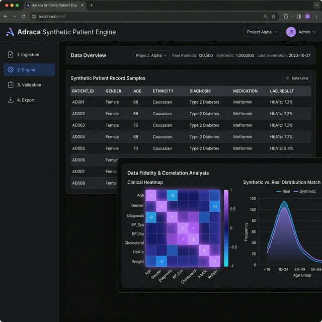

# Adraca Synthetic Patient Engine 🧬

An offline, scalable, privacy-preserving synthetic data generation platform designed to synthesize highly realistic patient records with mathematical privacy guarantees.

## Project Overview

The Adraca Synthetic Patient Engine empowers medical institutions and digital health researchers to build, train, and test machine learning models using hyper-realistic synthetic datasets without violating HIPAA / GDPR compliance or risking patient data leaks. 

By running offline statistical frameworks that evaluate mathematical fidelity against real demographic data, the engine generates an identical twin dataset while utilizing a strict utility constraint engine (measuring Exact Match Rate and Singling-Out Risk probabilities) to prevent re-identification. 

## Base Architecture

Our infrastructure is strictly designed for **air-gapped** execution, ensuring critical medical data never leaves the host server environment.

1. **SDV Generation (Gaussian Copula):** Synthesizes categorical, numerical, and datetime clinical records seamlessly into a cohesive DataFrame.
2. **Anonymeter Privacy Validation:** Actively tests generated distributions for Exact Match (DCR) and bounds Inference Risk statically below 0.09.
3. **Local SQLite Storage Pipeline:** Bi-directionally reads raw data and auto-exports synthetic iterations into a local `.db` without relying on insecure cloud endpoints.
4. **Streamlit UI Interface:** A powerful, highly-concurrent local Web Application serving a dynamic dashboard strictly on `localhost:8501`.
5. **Zero-Trust Multi-Stage Docker:** Features an ephemeral build sequence to compile heavy C++ analytics tooling natively, dropping them before establishing a clean, secure Runner image ready for offline Kubernetes deployment.

## Deployment & Branch Rules

- **`main`**: Hosts the complete architectural overview and enterprise-ready versions of the Adraca core modules.
- **`Automation`**: The active continuous integration testing staging ground. Hosts all Python PyTest regression test suites, strictly audited Flake8 lint configurations, and GitHub Actions CD pipelines.
